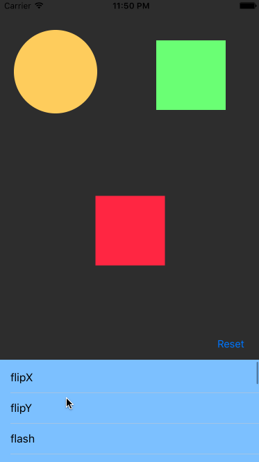

# Wave
Declarative chainable animations in Swift

[](https://travis-ci.org/onmyway133/Wave)
[](http://cocoadocs.org/docsets/Wave)
[](https://github.com/Carthage/Carthage)
[](http://cocoadocs.org/docsets/Wave)
[](http://cocoadocs.org/docsets/Wave)


## Features

- Declarative
- Run animations in sequence
- Run animations in parallel
- Support UIView and Core Animation animations
- Extensible

<div align = "center">

<br />
</div>

## Usage

```swift
view.run(.sequence([
  .fadeIn(),
  .fadeOut(),
  .parallel([
    .wait(0.5),
    .shake(),
    .log("Has just been shaked")
    .sequence([
      .flipX()
    ]),
    .morph()
  ])
]))
```

## Installation

**Wave** is available through [CocoaPods](http://cocoapods.org). To install
it, simply add the following line to your Podfile:

```ruby
pod 'Wave'
```

**Wave** is also available through [Carthage](https://github.com/Carthage/Carthage).
To install just write into your Cartfile:

```ruby
github "onmyway133/Wave"
```

## Author

Khoa Pham, onmyway133@gmail.com

## Credit

- https://www.swiftbysundell.com/posts/building-a-declarative-animation-framework-in-swift-part-1

## Contributing

We would love you to contribute to **Wave**, check the [CONTRIBUTING](https://github.com/onmyway133/Wave/blob/master/CONTRIBUTING.md) file for more info.

## License

**Wave** is available under the MIT license. See the [LICENSE](https://github.com/onmyway133/Wave/blob/master/LICENSE.md) file for more info.
